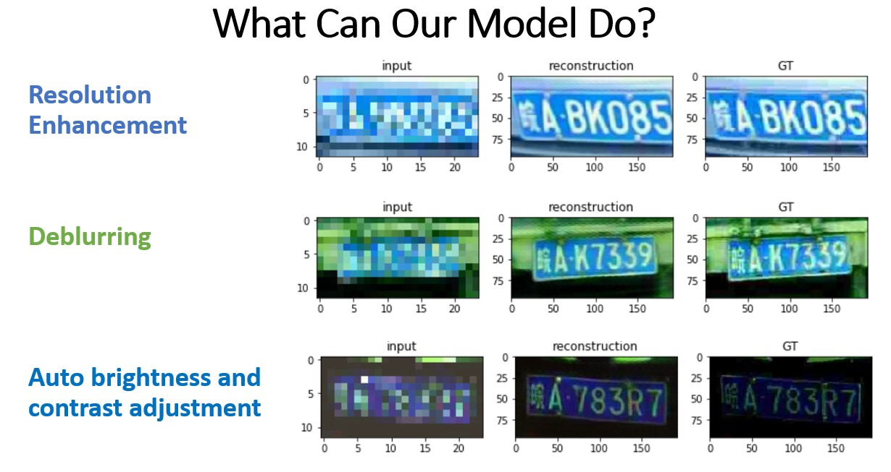
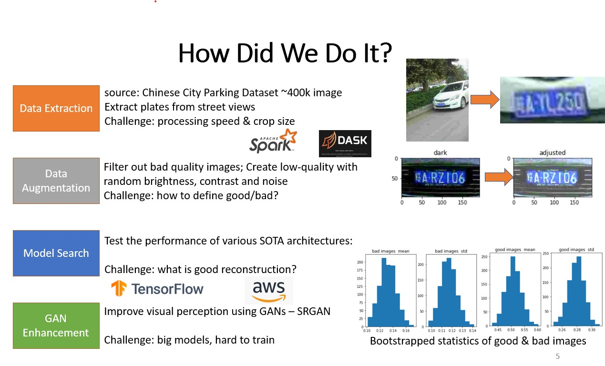
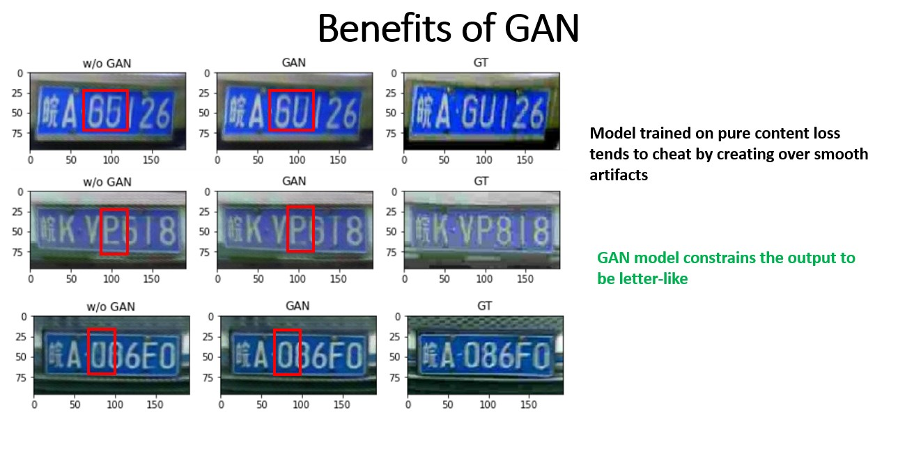
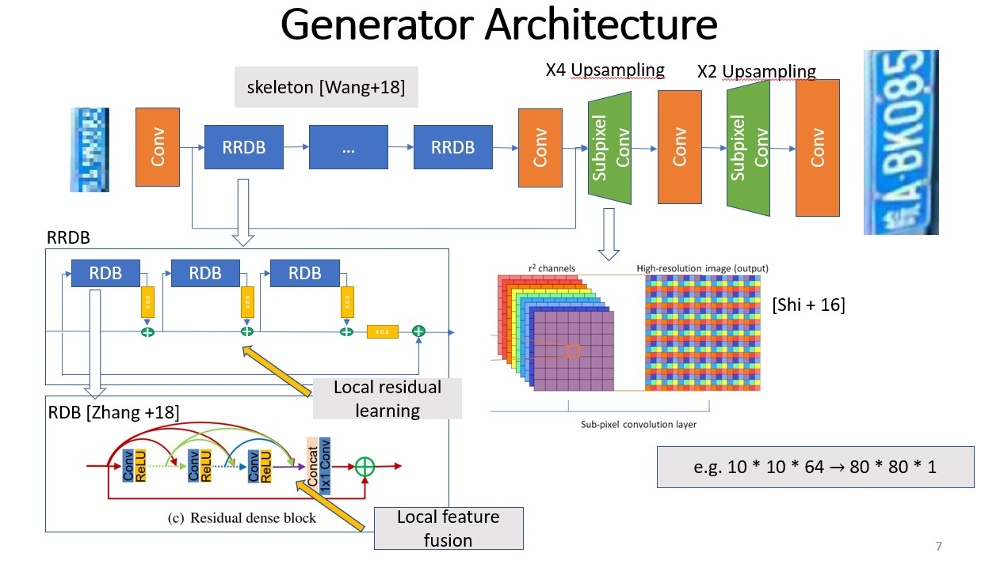
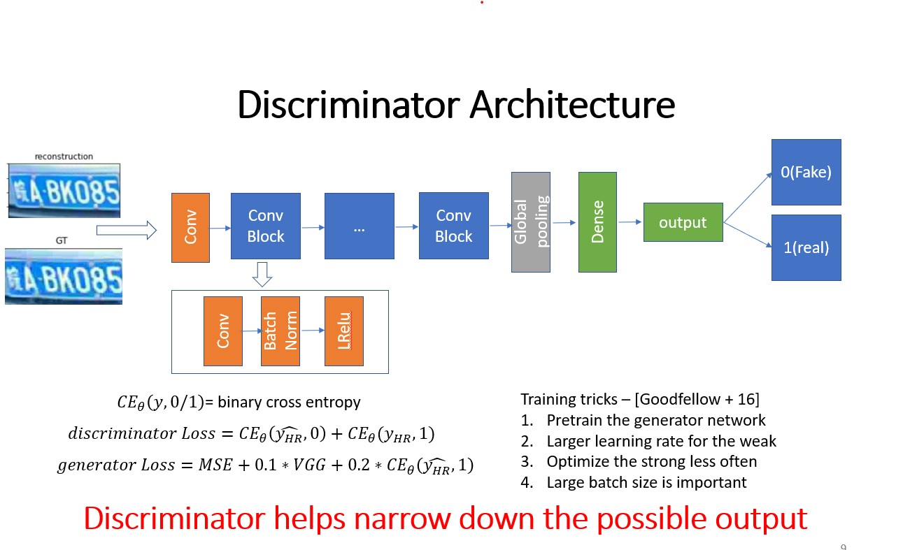

# License Plate Enhancement - From TV shows to reality 

Author: Zixuan Zhang, Chengxuan Cai
## Welcom to LicenseEnhancer 

In Hollywood crimes movies we often see detectives solving crimes with the help from one of 
their computer geeks who can reveal hidden information from blurred, low-quality images. This
project is an effort to achieve the same task, but on one specific type of image - license plates. 
License plate enhancement is a detailed application of a broader field called *Single Image Super Resolution* 
(SISR). 

The project is inspired by several state-of-the-art SRSR models such as: 
* [Photo-realistic single image super resolution using a Generative Adversarial Network](https://arxiv.org/abs/1609.04802)
* [Residual Dense Network for Image Super Resolution](https://arxiv.org/abs/1802.08797)
* [ESRGAN: Enhanced Super-Resolution Generative Adversarial Networks](https://arxiv.org/abs/1809.00219)
* [Real-Time Single Image and Video Super-Resolution Using an Efficient Sub-Pixel Convolutional Neural Network](https://arxiv.org/abs/1609.05158)

The dataset used in this project is called the [Chinese City Parking Dataset](https://github.com/detectRecog/CCPD), a large-scale collection of plate images in 
various conditions.  

Read my post on [Medium](https://towardsdatascience.com/license-plate-image-enhancement-5a170475bec1) for further understanding
## Gallery 

## Requirement 
Preprocessing
* Dask >= 2.11.0
* PIL >= 6.2.2  

Training & Evaluation
* tensorflow >= 2.1.0
* numpy >= 1.18.1
* matplotlib >= 3.1.3

## Pipeline

Before training the model it is important to preprocess the raw dataset using the preprocess.py script

## Model Architecture
Our plate enhancer model is trained in an adversarial fashion(GAN), meaning the generator is trained to create realistic 
reconstruction of images that can fool the discriminator, which is a binary classifier. Why GANs? Well, according to several 
papers, GAN network tend to create more realistic image reconstruction comparing to model solely trained in the supervised 
fashion. For instance, models that minimize Mean Square Error tend to have over-smoothing artifacts. 

Therefore, there are two models - the generator(reconstructor) and the discriminator(classifier).
#### Generator

The generator is trained to minimize a novel hybrid loss function, namely the perceptual loss defined in the SRGAN paper 

#### Discriminator 

## Acknowledgement 
I'd like to thank Olaoluwa Adigun for his amazing suggestions during the span of this project!
This project won the *Best Deep Learning Design Award* in USC EE599-Deep Learning. Here's the [link](https://drive.google.com/file/d/1VdCU_LArUe-KHj5vDVT0xyne9-bVK7n4/view)
 to our amazing rojects done by my classmates!   
Also, this project stands on the shoulder of many other SISR projects: 
* [ESPCN](https://github.com/leftthomas/ESPCN)
* [SRGAN](https://github.com/tensorlayer/srgan)
* [ESRGAN](https://github.com/xinntao/ESRGAN)

